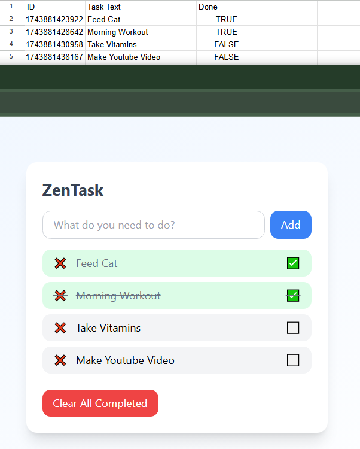

# ZenTask — React Frontend

ZenTask is a calm, minimalist task management app built with **React**, **Tailwind CSS**, and **Framer Motion**, powered by **Google Sheets** as a backend database.

It features task creation, completion toggles, deletion, and full persistence using Google Apps Script.

## 🌟 Features

- ✅ Add new tasks
- 🧼 Mark tasks as completed or pending
- 🗑️ Delete individual tasks
- 🔥 Clear all completed tasks
- 🔄 Syncs directly to a Google Sheet in real time
- ✨ Smooth UI animations with Framer Motion

## 📸 Preview



## 🚀 Getting Started

### 1. Install dependencies

```bash
npm install
```

### 2. Run the app

```bash
npm run dev
```

The app will be available at [http://localhost:5173](http://localhost:5173)

### 3. Connect to Backend

Make sure the backend server is running at `http://localhost:4000` (see `zentask-backend/`)

---

## 🧠 Tech Stack

- React
- Vite
- Tailwind CSS
- Framer Motion
- Custom Node backend + Google Apps Script

---

## 📄 File Structure

```
src/
├── App.jsx
├── main.jsx
├── components/
public/
tailwind.config.js
vite.config.js
```

---

## 🧪 Future Ideas

- Google sign-in (personalized task lists)
- Drag-and-drop task ordering
- Due dates, reminders
- Export to CSV / PDF
- Deploy to Netlify or Vercel

---

## ✨ Credits

Janet Phan

---

# ZenTask — Node + Google Sheets Backend

This is the lightweight Express.js server that connects your **React frontend** to your **Google Sheets database** via Google Apps Script.

It acts as a middleware for:

- ➕ Adding tasks
- 🔁 Updating task completion
- 🗑️ Deleting tasks
- 📄 Fetching all tasks on page load

---

## 🚀 Getting Started

### 1. Install dependencies

```bash
npm install
```

### 2. Run the server

```bash
node index.js
```

Server will run at: [http://localhost:4000](http://localhost:4000)

---

## 🌍 Environment Variables

Create a `.env` file and add your **Google Apps Script Web App URL**:

```
GOOGLE_SCRIPT_URL=https://script.google.com/macros/s/YOUR_SCRIPT_ID/exec
```

This keeps your API key out of your codebase.

---

## 📂 Routes

| Method | Endpoint         | Description            |
|--------|------------------|------------------------|
| GET    | `/tasks`         | Fetch tasks from Sheet |
| POST   | `/add-task`      | Add a new task         |
| POST   | `/update-task`   | Toggle task status     |
| POST   | `/delete-task`   | Delete a task          |

---

## 🧠 How It Works

- The backend receives JSON from the frontend
- It forwards the data to the Google Apps Script Web App
- The script reads/writes to your connected Google Sheet
- Logs are written to a separate `"Logs"` tab for debugging

---

## 🔐 TODO

- Validate inputs
- Rate-limit abuse
- Add session handling (if needed)

---

## ✨ Credits

Backend powered by:
- Express
- Node.js
- dotenv
- Google Apps Script + Sheets

Made with ☕ and 📋
